# 类图

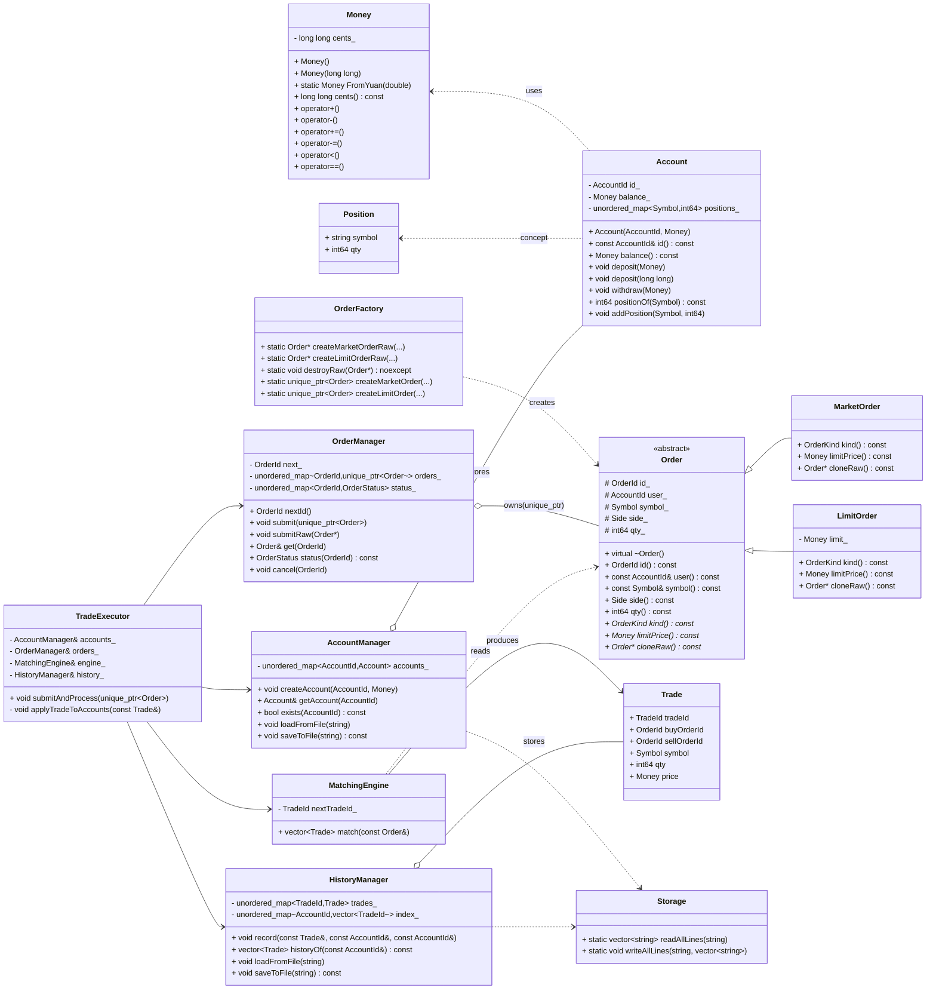
```mermaid
classDiagram
  direction LR

  class Money {
    - long long cents_
    + Money()
    + Money(long long)
    + static Money FromYuan(double)
    + long long cents() const
    + operator+()
    + operator-()
    + operator+=()
    + operator-=()
    + operator<()
    + operator==()
  }

  class Position {
    + string symbol
    + int64 qty
  }

  class Account {
    - AccountId id_
    - Money balance_
    - unordered_map~Symbol,int64~ positions_
    + Account(AccountId, Money)
    + const AccountId& id() const
    + Money balance() const
    + void deposit(Money)
    + void deposit(long long)
    + void withdraw(Money)
    + int64 positionOf(Symbol) const
    + void addPosition(Symbol, int64)
  }

  class Order {
    <<abstract>>
    # OrderId id_
    # AccountId user_
    # Symbol symbol_
    # Side side_
    # int64 qty_
    + virtual ~Order()
    + OrderId id() const
    + const AccountId& user() const
    + const Symbol& symbol() const
    + Side side() const
    + int64 qty() const
    + OrderKind kind() const*
    + Money limitPrice() const*
    + Order* cloneRaw() const*
  }

  class MarketOrder {
    + OrderKind kind() const
    + Money limitPrice() const
    + Order* cloneRaw() const
  }

  class LimitOrder {
    - Money limit_
    + OrderKind kind() const
    + Money limitPrice() const
    + Order* cloneRaw() const
  }

  class OrderFactory {
    + static Order* createMarketOrderRaw(...)
    + static Order* createLimitOrderRaw(...)
    + static void destroyRaw(Order*) noexcept
    + static unique_ptr~Order~ createMarketOrder(...)
    + static unique_ptr~Order~ createLimitOrder(...)
  }

  class OrderManager {
    - OrderId next_
    - unordered_map~OrderId,unique_ptr~Order~~ orders_
    - unordered_map~OrderId,OrderStatus~ status_
    + OrderId nextId()
    + void submit(unique_ptr~Order~)
    + void submitRaw(Order*)
    + Order& get(OrderId)
    + OrderStatus status(OrderId) const
    + void cancel(OrderId)
  }

  class Trade {
    + TradeId tradeId
    + OrderId buyOrderId
    + OrderId sellOrderId
    + Symbol symbol
    + int64 qty
    + Money price
  }

  class MatchingEngine {
    - TradeId nextTradeId_
    + vector~Trade~ match(const Order&)
  }

  class HistoryManager {
    - unordered_map~TradeId,Trade~ trades_
    - unordered_map~AccountId,vector~TradeId~~ index_
    + void record(const Trade&, const AccountId&, const AccountId&)
    + vector~Trade~ historyOf(const AccountId&) const
    + void loadFromFile(string)
    + void saveToFile(string) const
  }

  class AccountManager {
    - unordered_map~AccountId,Account~ accounts_
    + void createAccount(AccountId, Money)
    + Account& getAccount(AccountId)
    + bool exists(AccountId) const
    + void loadFromFile(string)
    + void saveToFile(string) const
  }

  class Storage {
    + static vector~string~ readAllLines(string)
    + static void writeAllLines(string, vector~string~)
  }

  class TradeExecutor {
    - AccountManager& accounts_
    - OrderManager& orders_
    - MatchingEngine& engine_
    - HistoryManager& history_
    + void submitAndProcess(unique_ptr~Order~)
    - void applyTradeToAccounts(const Trade&)
  }

  Money <.. Account : uses
  Position <.. Account : concept
  Order <|-- MarketOrder
  Order <|-- LimitOrder
  OrderFactory ..> Order : creates
  OrderManager o-- Order : owns(unique_ptr)
  MatchingEngine ..> Order : reads
  MatchingEngine --> Trade : produces
  HistoryManager o-- Trade : stores
  AccountManager o-- Account : stores
  TradeExecutor --> AccountManager
  TradeExecutor --> OrderManager
  TradeExecutor --> MatchingEngine
  TradeExecutor --> HistoryManager
  AccountManager ..> Storage
  HistoryManager ..> Storage

```
---

# 活动图

## 下单执行主流程：TradeExecutor::submitAndProcess(order)

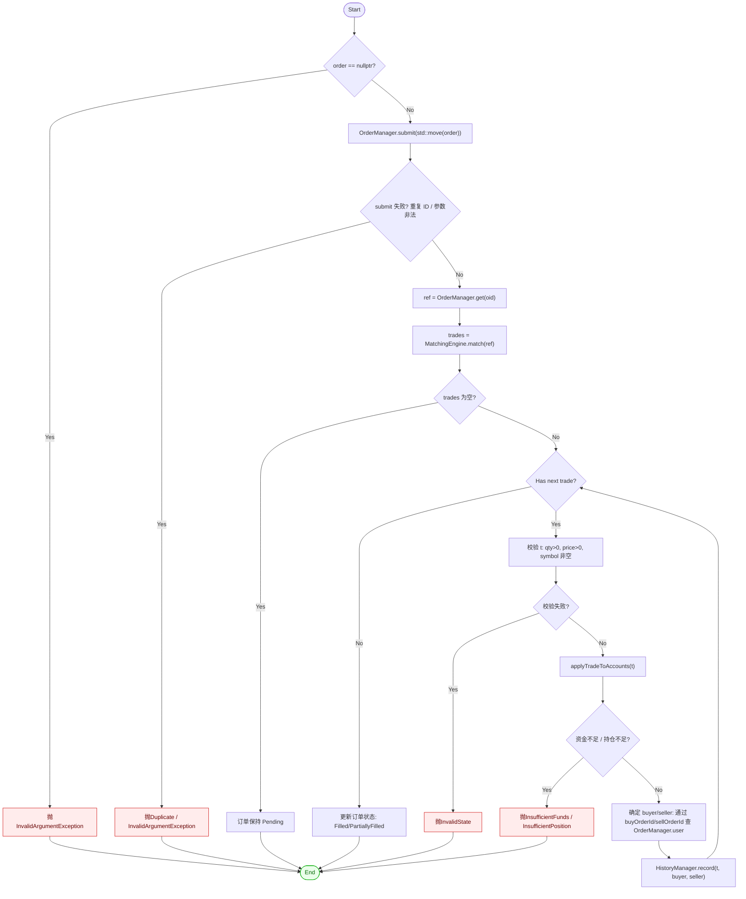
```mermaid
flowchart TD
  classDef err fill:#ffecec,stroke:#c00,color:#600
  classDef ok fill:#eaffea,stroke:#0a0,color:#060

  A([Start]) --> B{"order == nullptr?"}
  B -- Yes --> E_InvalidArg["抛InvalidArgumentException"]
  B -- No --> C["OrderManager.submit(std::move(order))"]
  C --> D{"submit 失败? 重复 ID / 参数非法"}
  D -- Yes --> E_SubmitFail["抛Duplicate / InvalidArgumentException"]
  D -- No --> F["ref = OrderManager.get(oid)"]
  F --> G["trades = MatchingEngine.match(ref)"]
  G --> H{"trades 为空?"}
  H -- Yes --> I["订单保持 Pending"]
  H -- No --> T{"Has next trade?"}
  T -- No --> Q["更新订单状态: Filled/PartiallyFilled"]
  T -- Yes --> K["校验 t: qty>0, price>0, symbol 非空"]
  K --> L{"校验失败?"}
  L -- Yes --> E_InvalidState["抛InvalidState"]
  L -- No --> M["applyTradeToAccounts(t)"]
  M --> N{"资金不足 / 持仓不足?"}
  N -- Yes --> E_Insufficient["抛InsufficientFunds / InsufficientPosition"]
  N -- No --> O["确定 buyer/seller: 通过 buyOrderId/sellOrderId 查 OrderManager.user"]
  O --> P["HistoryManager.record(t, buyer, seller)"]
  P --> T

  E_InvalidArg --> Z([End])
  E_SubmitFail --> Z
  E_InvalidState --> Z
  E_Insufficient --> Z
  I --> Z
  Q --> Z

  class E_InvalidArg,E_SubmitFail,E_InvalidState,E_Insufficient err
  class Z ok
```

## AccountManager::createAccount(id, initial)

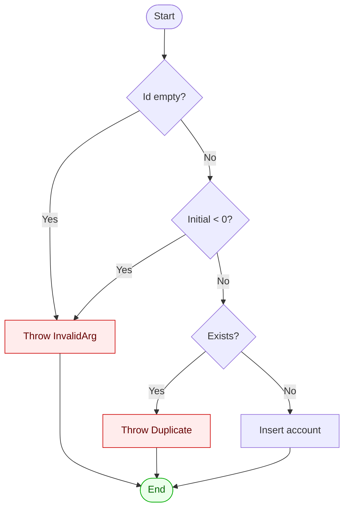
```mermaid
flowchart TD
  classDef err fill:#ffecec,stroke:#c00,color:#600
  classDef ok fill:#eaffea,stroke:#0a0,color:#060

  A([Start]) --> B{Id empty?}
  B -- Yes --> E_Invalid[Throw InvalidArg]
  B -- No --> C{Initial < 0?}
  C -- Yes --> E_Invalid
  C -- No --> D{Exists?}
  D -- Yes --> E_Duplicate[Throw Duplicate]
  D -- No --> E[Insert account]
  E --> Z([End])
  E_Invalid --> Z
  E_Duplicate --> Z

  class E_Invalid,E_Duplicate err
  class Z ok
```

## AccountManager::loadFromFile(path)
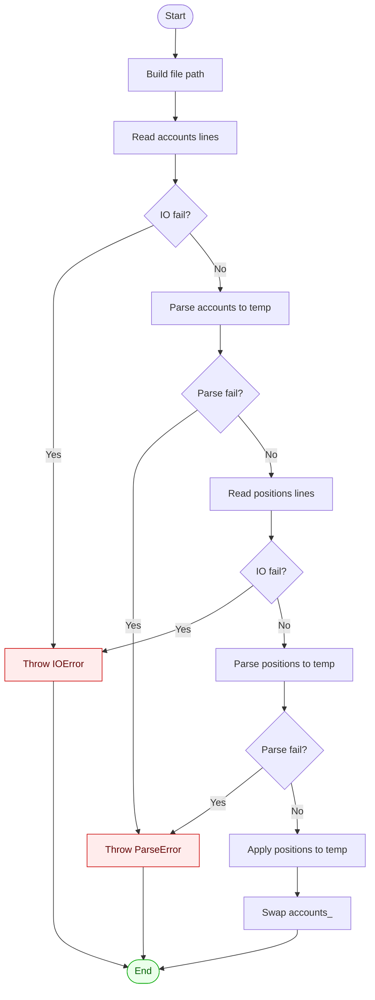
```mermaid
flowchart TD
  classDef err fill:#ffecec,stroke:#c00,color:#600
  classDef ok fill:#eaffea,stroke:#0a0,color:#060

  A([Start]) --> B[Build file path]
  B --> C[Read accounts lines]
  C --> D{IO fail?}
  D -- Yes --> E_IO[Throw IOError]
  D -- No --> E[Parse accounts to temp]
  E --> F{Parse fail?}
  F -- Yes --> E_Parse[Throw ParseError]
  F -- No --> G[Read positions lines]
  G --> H{IO fail?}
  H -- Yes --> E_IO
  H -- No --> I[Parse positions to temp]
  I --> J{Parse fail?}
  J -- Yes --> E_Parse
  J -- No --> K[Apply positions to temp]
  K --> L[Swap accounts_]
  L --> Z([End])
  E_IO --> Z
  E_Parse --> Z

  class E_IO,E_Parse err
  class Z ok
```

## AccountManager::saveToFile(path)
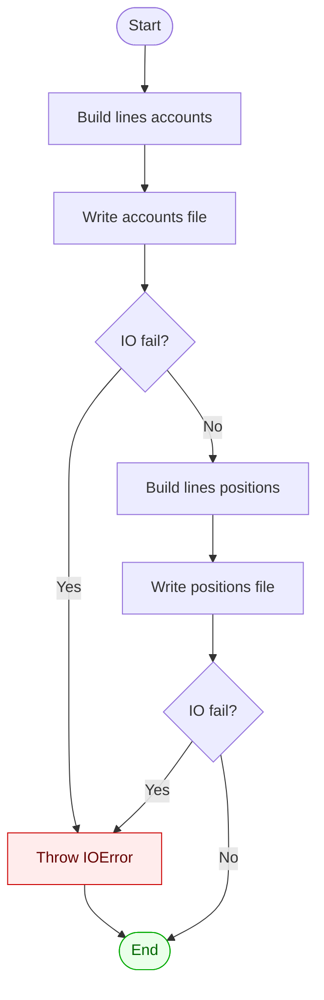
```mermaid
flowchart TD
  classDef err fill:#ffecec,stroke:#c00,color:#600
  classDef ok fill:#eaffea,stroke:#0a0,color:#060

  A([Start]) --> B[Build lines accounts]
  B --> C[Write accounts file]
  C --> D{IO fail?}
  D -- Yes --> E_IO[Throw IOError]
  D -- No --> E[Build lines positions]
  E --> F[Write positions file]
  F --> G{IO fail?}
  G -- Yes --> E_IO
  G -- No --> Z([End])
  E_IO --> Z

  class E_IO err
  class Z ok
```
## OrderManager::submit(order) / submitRaw(rawOrder)

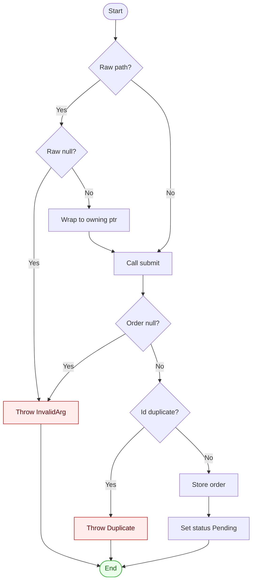
```mermaid
flowchart TD
  classDef err fill:#ffecec,stroke:#c00,color:#600
  classDef ok fill:#eaffea,stroke:#0a0,color:#060

  A([Start]) --> B{Raw path?}
  B -- Yes --> C{Raw null?}
  C -- Yes --> E_Invalid[Throw InvalidArg]
  C -- No --> D[Wrap to owning ptr]
  D --> S[Call submit]
  B -- No --> S
  S --> F{Order null?}
  F -- Yes --> E_Invalid
  F -- No --> G{Id duplicate?}
  G -- Yes --> E_Duplicate[Throw Duplicate]
  G -- No --> H[Store order]
  H --> I[Set status Pending]
  I --> Z([End])
  E_Invalid --> Z
  E_Duplicate --> Z

  class E_Invalid,E_Duplicate err
  class Z ok
```

## OrderManager::cancel(id)

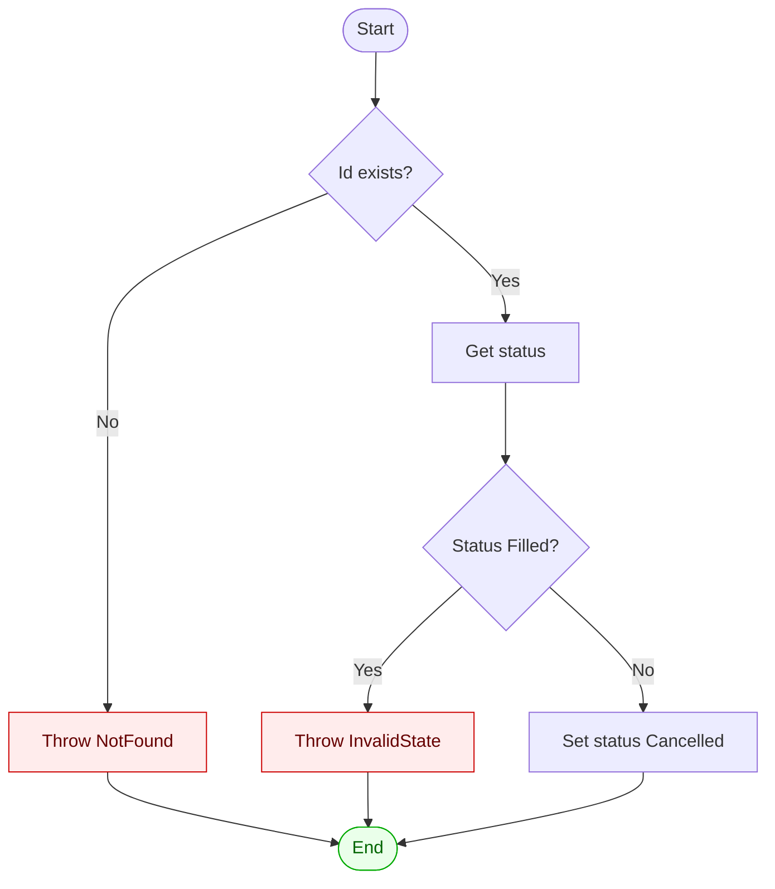
```mermaid
flowchart TD
  classDef err fill:#ffecec,stroke:#c00,color:#600
  classDef ok fill:#eaffea,stroke:#0a0,color:#060

  A([Start]) --> B{Id exists?}
  B -- No --> E_NotFound[Throw NotFound]
  B -- Yes --> C[Get status]
  C --> D{Status Filled?}
  D -- Yes --> E_Invalid[Throw InvalidState]
  D -- No --> E[Set status Cancelled]
  E --> Z([End])
  E_NotFound --> Z
  E_Invalid --> Z

  class E_NotFound,E_Invalid err
  class Z ok
```

## MatchingEngine::match(incoming)

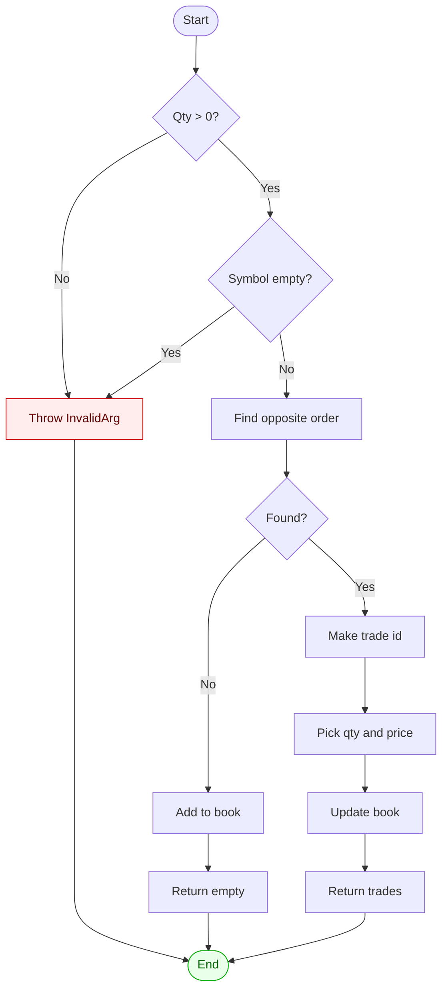
```mermaid
flowchart TD
  classDef err fill:#ffecec,stroke:#c00,color:#600
  classDef ok fill:#eaffea,stroke:#0a0,color:#060

  A([Start]) --> B{Qty > 0?}
  B -- No --> E_Invalid[Throw InvalidArg]
  B -- Yes --> C{Symbol empty?}
  C -- Yes --> E_Invalid
  C -- No --> D[Find opposite order]
  D --> E{Found?}
  E -- No --> F[Add to book]
  F --> G[Return empty]
  G --> Z([End])
  E -- Yes --> I[Make trade id]
  I --> J[Pick qty and price]
  J --> K[Update book]
  K --> L[Return trades]
  L --> Z
  E_Invalid --> Z

  class E_Invalid err
  class Z ok
```

## HistoryManager::record(t, buyer, seller)
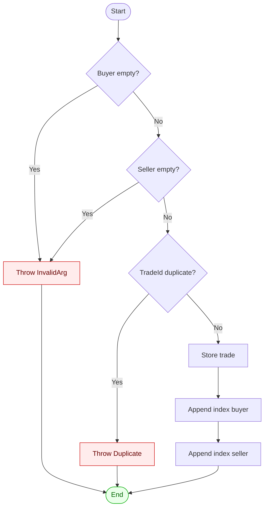
```mermaid
flowchart TD
  classDef err fill:#ffecec,stroke:#c00,color:#600
  classDef ok fill:#eaffea,stroke:#0a0,color:#060

  A([Start]) --> B{Buyer empty?}
  B -- Yes --> E_Invalid[Throw InvalidArg]
  B -- No --> C{Seller empty?}
  C -- Yes --> E_Invalid
  C -- No --> D{TradeId duplicate?}
  D -- Yes --> E_Duplicate[Throw Duplicate]
  D -- No --> E[Store trade]
  E --> F[Append index buyer]
  F --> G[Append index seller]
  G --> Z([End])
  E_Invalid --> Z
  E_Duplicate --> Z

  class E_Invalid,E_Duplicate err
  class Z ok
```

## HistoryManager::historyOf(user)
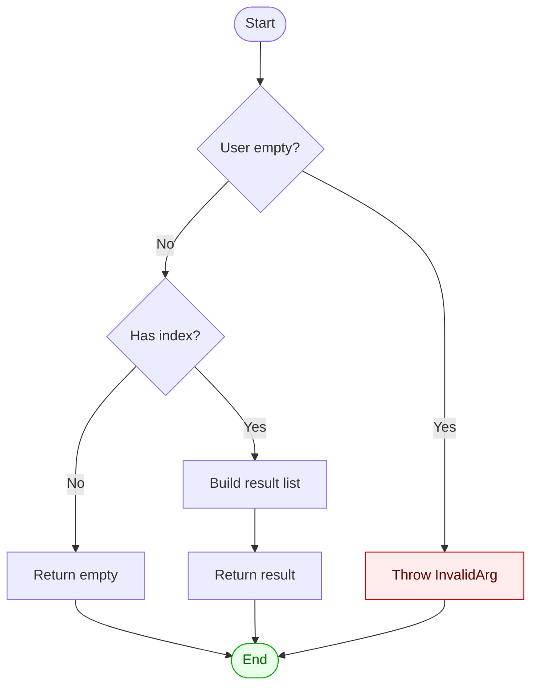
```mermaid
flowchart TD
  classDef err fill:#ffecec,stroke:#c00,color:#600
  classDef ok fill:#eaffea,stroke:#0a0,color:#060

  A([Start]) --> B{User empty?}
  B -- Yes --> E_Invalid[Throw InvalidArg]
  B -- No --> C{Has index?}
  C -- No --> D[Return empty]
  D --> Z([End])
  C -- Yes --> F[Build result list]
  F --> G[Return result]
  G --> Z
  E_Invalid --> Z

  class E_Invalid err
  class Z ok
```

## HistoryManager::loadFromFile(path)

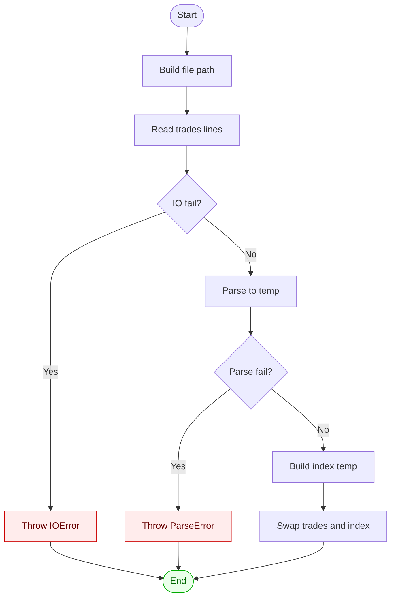
```mermaid
flowchart TD
  classDef err fill:#ffecec,stroke:#c00,color:#600
  classDef ok fill:#eaffea,stroke:#0a0,color:#060

  A([Start]) --> B[Build file path]
  B --> C[Read trades lines]
  C --> D{IO fail?}
  D -- Yes --> E_IO[Throw IOError]
  D -- No --> E[Parse to temp]
  E --> F{Parse fail?}
  F -- Yes --> E_Parse[Throw ParseError]
  F -- No --> G[Build index temp]
  G --> H[Swap trades and index]
  H --> Z([End])
  E_IO --> Z
  E_Parse --> Z

  class E_IO,E_Parse err
  class Z ok
```

## HistoryManager::saveToFile(path)
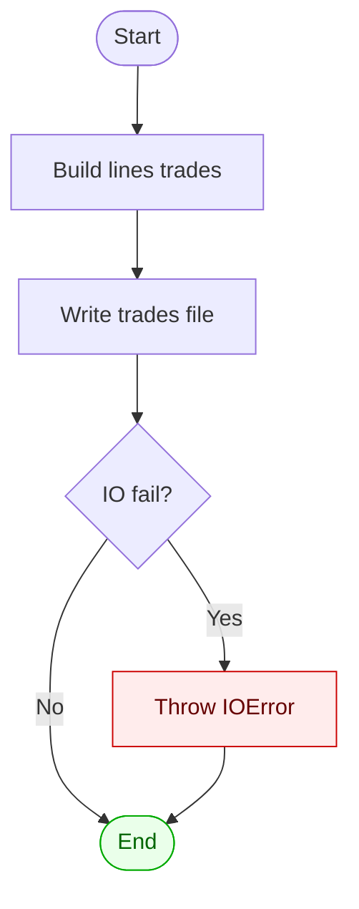
```mermaid
flowchart TD
  classDef err fill:#ffecec,stroke:#c00,color:#600
  classDef ok fill:#eaffea,stroke:#0a0,color:#060

  A([Start]) --> B[Build lines trades]
  B --> C[Write trades file]
  C --> D{IO fail?}
  D -- Yes --> E_IO[Throw IOError]
  D -- No --> Z([End])
  E_IO --> Z

  class E_IO err
  class Z ok
```

---

## Money

### Money::FromYuan(yuan)

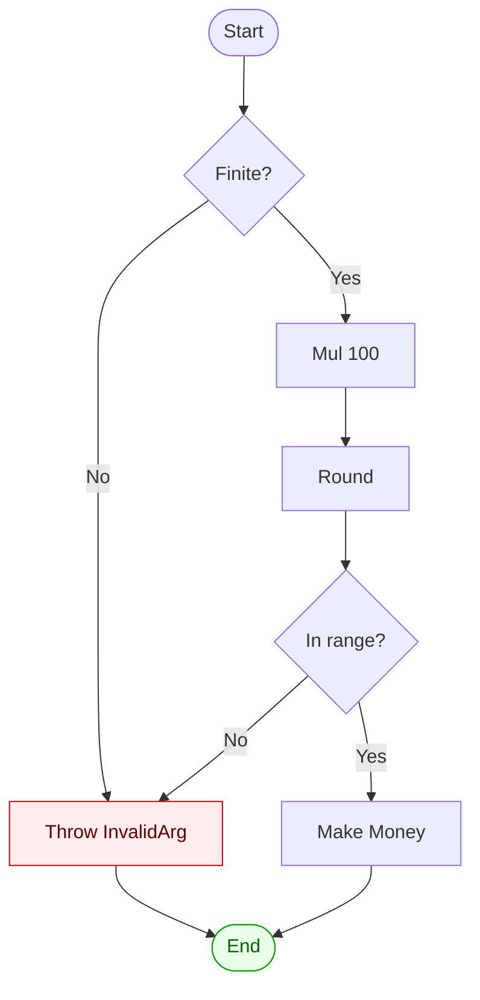
```mermaid
flowchart TD
  classDef err fill:#ffecec,stroke:#c00,color:#600
  classDef ok fill:#eaffea,stroke:#0a0,color:#060

  A([Start]) --> B{Finite?}
  B -- No --> E_Invalid[Throw InvalidArg]
  B -- Yes --> C[Mul 100]
  C --> D[Round]
  D --> E{In range?}
  E -- No --> E_Invalid
  E -- Yes --> F[Make Money]
  F --> Z([End])
  E_Invalid --> Z

  class E_Invalid err
  class Z ok
```

---

## Account

### Account::deposit(amount)

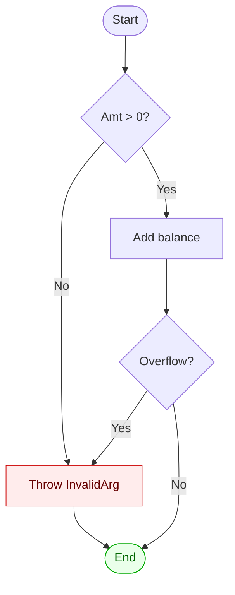
```mermaid
flowchart TD
  classDef err fill:#ffecec,stroke:#c00,color:#600
  classDef ok fill:#eaffea,stroke:#0a0,color:#060

  A([Start]) --> B{Amt > 0?}
  B -- No --> E_Invalid[Throw InvalidArg]
  B -- Yes --> C[Add balance]
  C --> D{Overflow?}
  D -- Yes --> E_Invalid
  D -- No --> Z([End])
  E_Invalid --> Z

  class E_Invalid err
  class Z ok
```

### Account::deposit(cents)

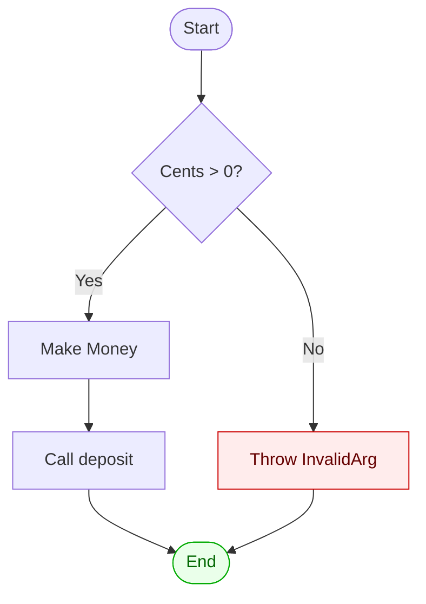
```mermaid
flowchart TD
  classDef err fill:#ffecec,stroke:#c00,color:#600
  classDef ok fill:#eaffea,stroke:#0a0,color:#060

  A([Start]) --> B{Cents > 0?}
  B -- No --> E_Invalid[Throw InvalidArg]
  B -- Yes --> C[Make Money]
  C --> D[Call deposit]
  D --> Z([End])
  E_Invalid --> Z

  class E_Invalid err
  class Z ok
```

### Account::withdraw(amount)

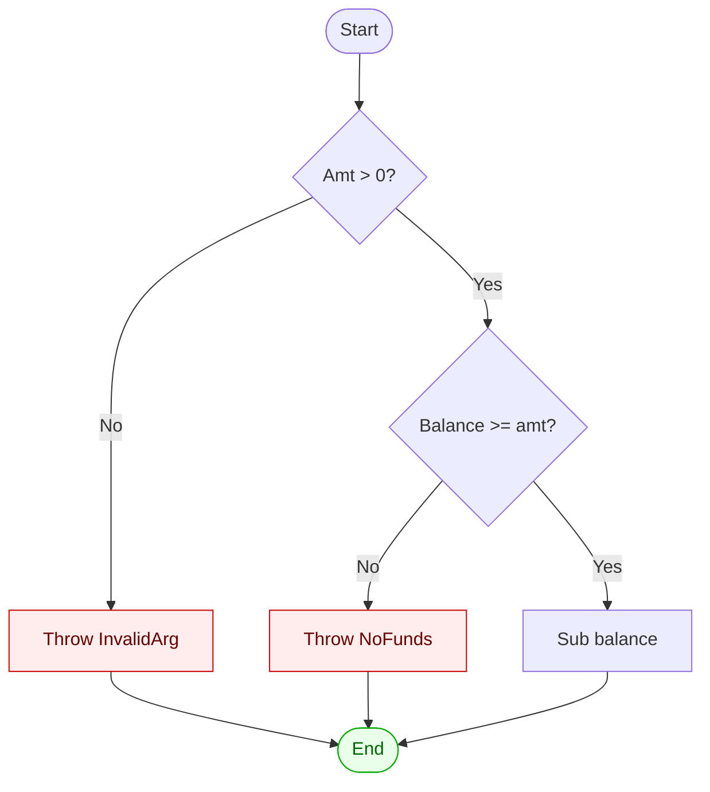
```mermaid
flowchart TD
  classDef err fill:#ffecec,stroke:#c00,color:#600
  classDef ok fill:#eaffea,stroke:#0a0,color:#060

  A([Start]) --> B{Amt > 0?}
  B -- No --> E_Invalid[Throw InvalidArg]
  B -- Yes --> C{Balance >= amt?}
  C -- No --> E_NoFunds[Throw NoFunds]
  C -- Yes --> D[Sub balance]
  D --> Z([End])
  E_Invalid --> Z
  E_NoFunds --> Z

  class E_Invalid,E_NoFunds err
  class Z ok
```

### Account::positionOf(sym)

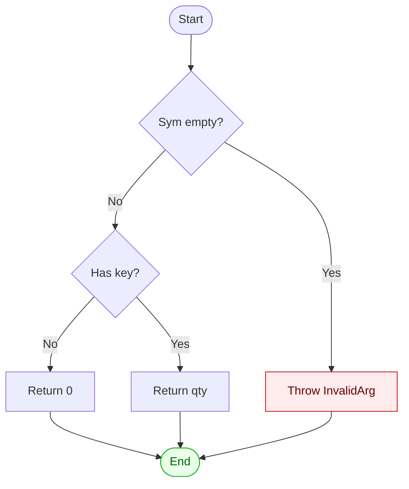
```mermaid
flowchart TD
  classDef err fill:#ffecec,stroke:#c00,color:#600
  classDef ok fill:#eaffea,stroke:#0a0,color:#060

  A([Start]) --> B{Sym empty?}
  B -- Yes --> E_Invalid[Throw InvalidArg]
  B -- No --> C{Has key?}
  C -- No --> D[Return 0]
  C -- Yes --> E[Return qty]
  D --> Z([End])
  E --> Z
  E_Invalid --> Z

  class E_Invalid err
  class Z ok
```

### Account::addPosition(sym, delta)

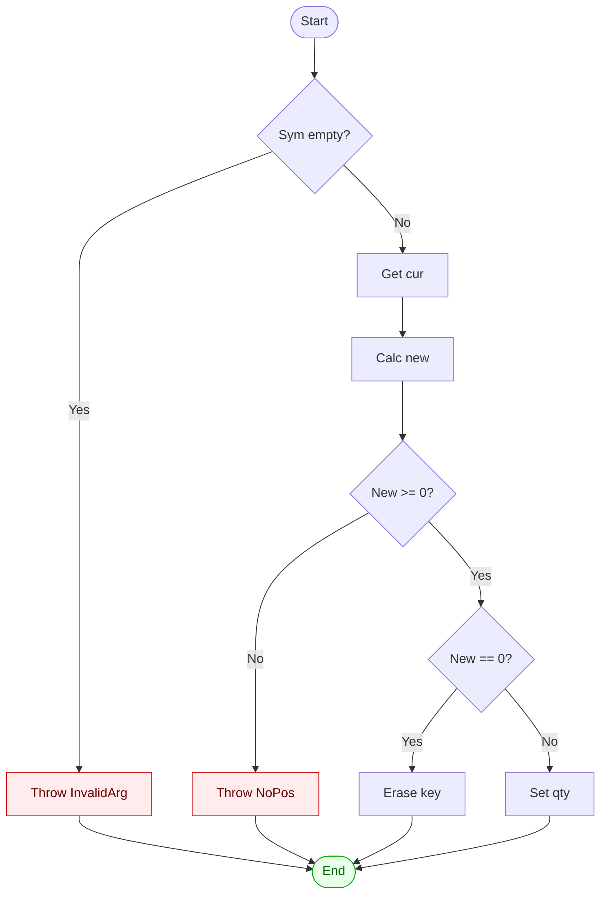
```mermaid
flowchart TD
  classDef err fill:#ffecec,stroke:#c00,color:#600
  classDef ok fill:#eaffea,stroke:#0a0,color:#060

  A([Start]) --> B{Sym empty?}
  B -- Yes --> E_Invalid[Throw InvalidArg]
  B -- No --> C[Get cur]
  C --> D[Calc new]
  D --> E{New >= 0?}
  E -- No --> E_NoPos[Throw NoPos]
  E -- Yes --> F{New == 0?}
  F -- Yes --> G[Erase key]
  F -- No --> H[Set qty]
  G --> Z([End])
  H --> Z
  E_Invalid --> Z
  E_NoPos --> Z

  class E_Invalid,E_NoPos err
  class Z ok
```

---

## Order（抽象基类）

> 抽象类方法本质是 **动态分派**，流程图就别装神弄鬼画太复杂了。

### Order::kind()

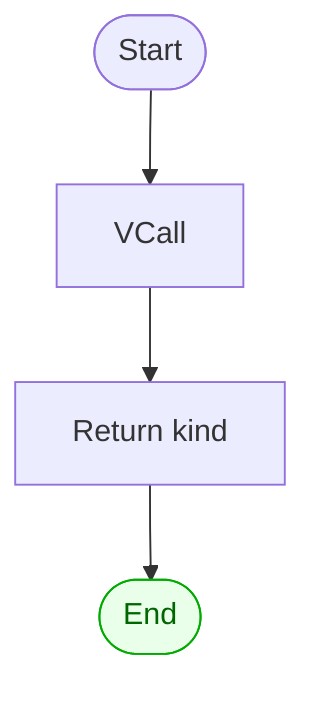
```mermaid
flowchart TD
  classDef ok fill:#eaffea,stroke:#0a0,color:#060

  A([Start]) --> B[VCall]
  B --> C[Return kind]
  C --> Z([End])

  class Z ok
```

### Order::limitPrice()

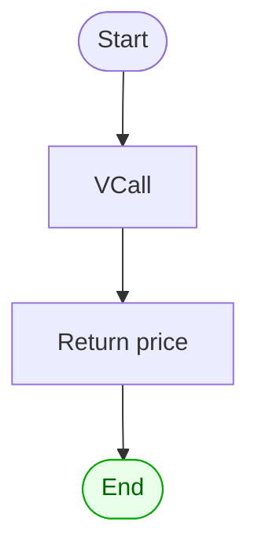
```mermaid
flowchart TD
  classDef ok fill:#eaffea,stroke:#0a0,color:#060

  A([Start]) --> B[VCall]
  B --> C[Return price]
  C --> Z([End])

  class Z ok
```

### Order::cloneRaw()

```mermaid
flowchart TD
  classDef err fill:#ffecec,stroke:#c00,color:#600
  classDef ok fill:#eaffea,stroke:#0a0,color:#060

  A([Start]) --> B[VCall]
  B --> C[New copy]
  C --> D{Alloc ok?}
  D -- No --> E_BadAlloc[Throw BadAlloc]
  D -- Yes --> E[Return raw]
  E --> Z([End])
  E_BadAlloc --> Z

  class E_BadAlloc err
  class Z ok
```

---

## MarketOrder

### MarketOrder::kind()

```mermaid
flowchart TD
  classDef ok fill:#eaffea,stroke:#0a0,color:#060

  A([Start]) --> B[Return Market]
  B --> Z([End])

  class Z ok
```

### MarketOrder::limitPrice()

```mermaid
flowchart TD
  classDef ok fill:#eaffea,stroke:#0a0,color:#060

  A([Start]) --> B[Return none]
  B --> Z([End])

  class Z ok
```

### MarketOrder::cloneRaw()

```mermaid
flowchart TD
  classDef err fill:#ffecec,stroke:#c00,color:#600
  classDef ok fill:#eaffea,stroke:#0a0,color:#060

  A([Start]) --> B[New MarketOrder]
  B --> C{Alloc ok?}
  C -- No --> E_BadAlloc[Throw BadAlloc]
  C -- Yes --> D[Copy fields]
  D --> E[Return raw]
  E --> Z([End])
  E_BadAlloc --> Z

  class E_BadAlloc err
  class Z ok
```

---

## LimitOrder

### LimitOrder::kind()

```mermaid
flowchart TD
  classDef ok fill:#eaffea,stroke:#0a0,color:#060

  A([Start]) --> B[Return Limit]
  B --> Z([End])

  class Z ok
```

### LimitOrder::limitPrice()

```mermaid
flowchart TD
  classDef ok fill:#eaffea,stroke:#0a0,color:#060

  A([Start]) --> B[Return limit]
  B --> Z([End])

  class Z ok
```

### LimitOrder::cloneRaw()

```mermaid
flowchart TD
  classDef err fill:#ffecec,stroke:#c00,color:#600
  classDef ok fill:#eaffea,stroke:#0a0,color:#060

  A([Start]) --> B[New LimitOrder]
  B --> C{Alloc ok?}
  C -- No --> E_BadAlloc[Throw BadAlloc]
  C -- Yes --> D[Copy fields]
  D --> E[Return raw]
  E --> Z([End])
  E_BadAlloc --> Z

  class E_BadAlloc err
  class Z ok
```

---

## OrderFactory

### OrderFactory::createMarketOrderRaw(id, user, sym, side, qty)

```mermaid
flowchart TD
  classDef err fill:#ffecec,stroke:#c00,color:#600
  classDef ok fill:#eaffea,stroke:#0a0,color:#060

  A([Start]) --> B{User empty?}
  B -- Yes --> E_Invalid[Throw InvalidArg]
  B -- No --> C{Sym empty?}
  C -- Yes --> E_Invalid
  C -- No --> D{Qty > 0?}
  D -- No --> E_Invalid
  D -- Yes --> E[New MarketOrder]
  E --> F{Alloc ok?}
  F -- No --> E_BadAlloc[Throw BadAlloc]
  F -- Yes --> G[Init fields]
  G --> H[Return raw]
  H --> Z([End])
  E_Invalid --> Z
  E_BadAlloc --> Z

  class E_Invalid,E_BadAlloc err
  class Z ok
```

### OrderFactory::createLimitOrderRaw(id, user, sym, side, qty, limit)

```mermaid
flowchart TD
  classDef err fill:#ffecec,stroke:#c00,color:#600
  classDef ok fill:#eaffea,stroke:#0a0,color:#060

  A([Start]) --> B{User empty?}
  B -- Yes --> E_Invalid[Throw InvalidArg]
  B -- No --> C{Sym empty?}
  C -- Yes --> E_Invalid
  C -- No --> D{Qty > 0?}
  D -- No --> E_Invalid
  D -- Yes --> E{Limit > 0?}
  E -- No --> E_Invalid
  E -- Yes --> F[New LimitOrder]
  F --> G{Alloc ok?}
  G -- No --> E_BadAlloc[Throw BadAlloc]
  G -- Yes --> H[Init fields]
  H --> I[Return raw]
  I --> Z([End])
  E_Invalid --> Z
  E_BadAlloc --> Z

  class E_Invalid,E_BadAlloc err
  class Z ok
```

### OrderFactory::destroyRaw(raw)

```mermaid
flowchart TD
  classDef ok fill:#eaffea,stroke:#0a0,color:#060

  A([Start]) --> B{Raw null?}
  B -- Yes --> Z([End])
  B -- No --> D[Delete raw]
  D --> Z

  class Z ok
```

### OrderFactory::createMarketOrder(id, user, sym, side, qty)

```mermaid
flowchart TD
  classDef err fill:#ffecec,stroke:#c00,color:#600
  classDef ok fill:#eaffea,stroke:#0a0,color:#060

  A([Start]) --> B[Call createRaw]
  B --> C{Throw?}
  C -- Yes --> E_Throw[Propagate]
  C -- No --> D[Wrap unique]
  D --> E[Return obj]
  E --> Z([End])
  E_Throw --> Z

  class E_Throw err
  class Z ok
```

### OrderFactory::createLimitOrder(id, user, sym, side, qty, limit)

```mermaid
flowchart TD
  classDef err fill:#ffecec,stroke:#c00,color:#600
  classDef ok fill:#eaffea,stroke:#0a0,color:#060

  A([Start]) --> B[Call createRaw]
  B --> C{Throw?}
  C -- Yes --> E_Throw[Propagate]
  C -- No --> D[Wrap unique]
  D --> E[Return obj]
  E --> Z([End])
  E_Throw --> Z

  class E_Throw err
  class Z ok
```

---

## core

### AccountManager::getAccount(id) / getAccount(id) const

> 两个重载流程一样，区别只是返回 `ref` 还是 `const ref`。

```mermaid
flowchart TD
  classDef err fill:#ffecec,stroke:#c00,color:#600
  classDef ok fill:#eaffea,stroke:#0a0,color:#060

  A([Start]) --> B{Id found?}
  B -- No --> E_NotFound[Throw NotFound]
  B -- Yes --> C[Return ref]
  C --> Z([End])
  E_NotFound --> Z

  class E_NotFound err
  class Z ok
```

---

### AccountManager::exists(id) const noexcept

```mermaid
flowchart TD
  classDef ok fill:#eaffea,stroke:#0a0,color:#060

  A([Start]) --> B{Id found?}
  B -- Yes --> C[Return true]
  B -- No --> D[Return false]
  C --> Z([End])
  D --> Z

  class Z ok
```

---

### OrderManager::nextId() noexcept

> 不抛异常，所以只画“取号并前进”。
> （人类喜欢把这个叫“订单编号分配策略”，其实就是 `++`。）

```mermaid
flowchart TD
  classDef ok fill:#eaffea,stroke:#0a0,color:#060

  A([Start]) --> B[Load next]
  B --> C[Inc next]
  C --> D[Return id]
  D --> Z([End])

  class Z ok
```

---

### OrderManager::get(id) / get(id) const

```mermaid
flowchart TD
  classDef err fill:#ffecec,stroke:#c00,color:#600
  classDef ok fill:#eaffea,stroke:#0a0,color:#060

  A([Start]) --> B{Id found?}
  B -- No --> E_NotFound[Throw NotFound]
  B -- Yes --> C[Return ref]
  C --> Z([End])
  E_NotFound --> Z

  class E_NotFound err
  class Z ok
```

---

### OrderManager::status(id) const

```mermaid
flowchart TD
  classDef err fill:#ffecec,stroke:#c00,color:#600
  classDef ok fill:#eaffea,stroke:#0a0,color:#060

  A([Start]) --> B{Id found?}
  B -- No --> E_NotFound[Throw NotFound]
  B -- Yes --> C[Load status]
  C --> D[Return status]
  D --> Z([End])
  E_NotFound --> Z

  class E_NotFound err
  class Z ok
```

---

## io

### Storage::readAllLines(path)

```mermaid
flowchart TD
  classDef err fill:#ffecec,stroke:#c00,color:#600
  classDef ok fill:#eaffea,stroke:#0a0,color:#060

  A([Start]) --> B[Open file]
  B --> C{Open ok?}
  C -- No --> E_IO[Throw IOError]
  C -- Yes --> D[Read line loop]
  D --> E{EOF?}
  E -- No --> F[Push line]
  F --> D
  E -- Yes --> G[Return lines]
  G --> Z([End])
  E_IO --> Z

  class E_IO err
  class Z ok
```

---

### Storage::writeAllLines(path, lines)

```mermaid
flowchart TD
  classDef err fill:#ffecec,stroke:#c00,color:#600
  classDef ok fill:#eaffea,stroke:#0a0,color:#060

  A([Start]) --> B[Open file]
  B --> C{Open ok?}
  C -- No --> E_IO[Throw IOError]
  C -- Yes --> D[Write line loop]
  D --> E{Done?}
  E -- No --> F[Write line]
  F --> G{Write ok?}
  G -- No --> E_IO
  G -- Yes --> D
  E -- Yes --> Z([End])
  E_IO --> Z

  class E_IO err
  class Z ok
```

---

## 补充：骨架其余函数

### Money::Money()

```mermaid
flowchart TD
  classDef ok fill:#eaffea,stroke:#0a0,color:#060

  A([Start]) --> B[Init cents_ = 0]
  B --> Z([End])

  class Z ok
```

### Money::Money(cents)

```mermaid
flowchart TD
  classDef ok fill:#eaffea,stroke:#0a0,color:#060

  A([Start]) --> B[Set cents_ = cents]
  B --> Z([End])

  class Z ok
```

### Money::cents()

```mermaid
flowchart TD
  classDef ok fill:#eaffea,stroke:#0a0,color:#060

  A([Start]) --> B[Return cents_]
  B --> Z([End])

  class Z ok
```

### Money::operator+(rhs)

```mermaid
flowchart TD
  classDef ok fill:#eaffea,stroke:#0a0,color:#060

  A([Start]) --> B[Compute sum]
  B --> C[Return Money]
  C --> Z([End])

  class Z ok
```

### Money::operator-(rhs)

```mermaid
flowchart TD
  classDef ok fill:#eaffea,stroke:#0a0,color:#060

  A([Start]) --> B[Compute diff]
  B --> C[Return Money]
  C --> Z([End])

  class Z ok
```

### Money::operator+=(rhs)

```mermaid
flowchart TD
  classDef ok fill:#eaffea,stroke:#0a0,color:#060

  A([Start]) --> B[Add rhs to cents_]
  B --> C[Return self]
  C --> Z([End])

  class Z ok
```

### Money::operator-=(rhs)

```mermaid
flowchart TD
  classDef ok fill:#eaffea,stroke:#0a0,color:#060

  A([Start]) --> B[Subtract rhs from cents_]
  B --> C[Return self]
  C --> Z([End])

  class Z ok
```

### Money::operator<(rhs)

```mermaid
flowchart TD
  classDef ok fill:#eaffea,stroke:#0a0,color:#060

  A([Start]) --> B[Compare cents]
  B --> C[Return bool]
  C --> Z([End])

  class Z ok
```

### Money::operator==(rhs)

```mermaid
flowchart TD
  classDef ok fill:#eaffea,stroke:#0a0,color:#060

  A([Start]) --> B[Compare cents]
  B --> C[Return bool]
  C --> Z([End])

  class Z ok
```

### operator<<(os, money)

```mermaid
flowchart TD
  classDef ok fill:#eaffea,stroke:#0a0,color:#060

  A([Start]) --> B[Write cents_ to stream]
  B --> C[Return stream]
  C --> Z([End])

  class Z ok
```

---

### Account::Account()

```mermaid
flowchart TD
  classDef ok fill:#eaffea,stroke:#0a0,color:#060

  A([Start]) --> B[Init id_ empty]
  B --> C[Init balance_ = 0]
  C --> D[Init positions_ empty]
  D --> Z([End])

  class Z ok
```

### Account::Account(id, initial)

```mermaid
flowchart TD
  classDef ok fill:#eaffea,stroke:#0a0,color:#060

  A([Start]) --> B[Move id into id_]
  B --> C[Set balance_ = initial]
  C --> D[Init positions_ empty]
  D --> Z([End])

  class Z ok
```

### Account::id()

```mermaid
flowchart TD
  classDef ok fill:#eaffea,stroke:#0a0,color:#060

  A([Start]) --> B[Return id_]
  B --> Z([End])

  class Z ok
```

### Account::balance()

```mermaid
flowchart TD
  classDef ok fill:#eaffea,stroke:#0a0,color:#060

  A([Start]) --> B[Return balance_]
  B --> Z([End])

  class Z ok
```

---

### Order::Order(id, user, sym, side, qty)

```mermaid
flowchart TD
  classDef ok fill:#eaffea,stroke:#0a0,color:#060

  A([Start]) --> B[Set id_]
  B --> C[Move user/sym]
  C --> D[Set side_, qty_]
  D --> Z([End])

  class Z ok
```

### Order::id()

```mermaid
flowchart TD
  classDef ok fill:#eaffea,stroke:#0a0,color:#060

  A([Start]) --> B[Return id_]
  B --> Z([End])

  class Z ok
```

### Order::user()

```mermaid
flowchart TD
  classDef ok fill:#eaffea,stroke:#0a0,color:#060

  A([Start]) --> B[Return user_]
  B --> Z([End])

  class Z ok
```

### Order::symbol()

```mermaid
flowchart TD
  classDef ok fill:#eaffea,stroke:#0a0,color:#060

  A([Start]) --> B[Return symbol_]
  B --> Z([End])

  class Z ok
```

### Order::side()

```mermaid
flowchart TD
  classDef ok fill:#eaffea,stroke:#0a0,color:#060

  A([Start]) --> B[Return side_]
  B --> Z([End])

  class Z ok
```

### Order::qty()

```mermaid
flowchart TD
  classDef ok fill:#eaffea,stroke:#0a0,color:#060

  A([Start]) --> B[Return qty_]
  B --> Z([End])

  class Z ok
```

---

### MarketOrder::MarketOrder(id, user, sym, side, qty)

```mermaid
flowchart TD
  classDef ok fill:#eaffea,stroke:#0a0,color:#060

  A([Start]) --> B[Call Order ctor]
  B --> Z([End])

  class Z ok
```

### LimitOrder::LimitOrder(id, user, sym, side, qty, limit)

```mermaid
flowchart TD
  classDef ok fill:#eaffea,stroke:#0a0,color:#060

  A([Start]) --> B[Call Order ctor]
  B --> C[Set limit_]
  C --> Z([End])

  class Z ok
```

---

### TradeExecutor::TradeExecutor(am, om, me, hm)

```mermaid
flowchart TD
  classDef ok fill:#eaffea,stroke:#0a0,color:#060

  A([Start]) --> B[Store accounts_ and orders_]
  B --> C[Store engine_ and history_]
  C --> Z([End])

  class Z ok
```

### TradeExecutor::applyTradeToAccounts(t)

```mermaid
flowchart TD
  classDef ok fill:#eaffea,stroke:#0a0,color:#060

  A([Start]) --> B[TODO determine buyer seller]
  B --> C[TODO adjust balance and positions]
  C --> Z([End])

  class Z ok
```

---

### TradeSimException::TradeSimException(code, msg)

```mermaid
flowchart TD
  classDef ok fill:#eaffea,stroke:#0a0,color:#060

  A([Start]) --> B[Init runtime_error]
  B --> C[Set code_]
  C --> Z([End])

  class Z ok
```

### TradeSimException::code()

```mermaid
flowchart TD
  classDef ok fill:#eaffea,stroke:#0a0,color:#060

  A([Start]) --> B[Return code_]
  B --> Z([End])

  class Z ok
```

### NotFoundException::NotFoundException(msg)

```mermaid
flowchart TD
  classDef ok fill:#eaffea,stroke:#0a0,color:#060

  A([Start]) --> B[Call TradeSimException]
  B --> Z([End])

  class Z ok
```

### InvalidArgumentException::InvalidArgumentException(msg)

```mermaid
flowchart TD
  classDef ok fill:#eaffea,stroke:#0a0,color:#060

  A([Start]) --> B[Call TradeSimException]
  B --> Z([End])

  class Z ok
```

### InsufficientFundsException::InsufficientFundsException(msg)

```mermaid
flowchart TD
  classDef ok fill:#eaffea,stroke:#0a0,color:#060

  A([Start]) --> B[Call TradeSimException]
  B --> Z([End])

  class Z ok
```

### IOErrorException::IOErrorException(msg)

```mermaid
flowchart TD
  classDef ok fill:#eaffea,stroke:#0a0,color:#060

  A([Start]) --> B[Call TradeSimException]
  B --> Z([End])

  class Z ok
```

### ParseErrorException::ParseErrorException(msg)

```mermaid
flowchart TD
  classDef ok fill:#eaffea,stroke:#0a0,color:#060

  A([Start]) --> B[Call TradeSimException]
  B --> Z([End])

  class Z ok
```

---

### main() (src/main.cpp)

```mermaid
flowchart TD
  classDef err fill:#ffecec,stroke:#c00,color:#600
  classDef ok fill:#eaffea,stroke:#0a0,color:#060

  A([Start]) --> B[Init managers]
  B --> C[Create TradeExecutor]
  C --> D[Create accounts]
  D --> E[Create order]
  E --> F[Submit and process]
  F --> G{Exception thrown?}
  G -- Yes --> H[Print error and return 1]
  G -- No --> I[Print OK and return 0]
  H --> Z([End])
  I --> Z

  class H err
  class Z ok
```

### main() (test/smoke_test.cpp)

```mermaid
flowchart TD
  classDef err fill:#ffecec,stroke:#c00,color:#600
  classDef ok fill:#eaffea,stroke:#0a0,color:#060

  A([Start]) --> B[Create AccountManager]
  B --> C[Create account u1]
  C --> D[Assert exists]
  D --> E[Try getAccount missing]
  E --> F{NotFound thrown?}
  F -- Yes --> G[Assert true]
  F -- No --> H[Assert false]
  G --> I[Return 0]
  H --> I
  I --> Z([End])

  class H err
  class Z ok
```
